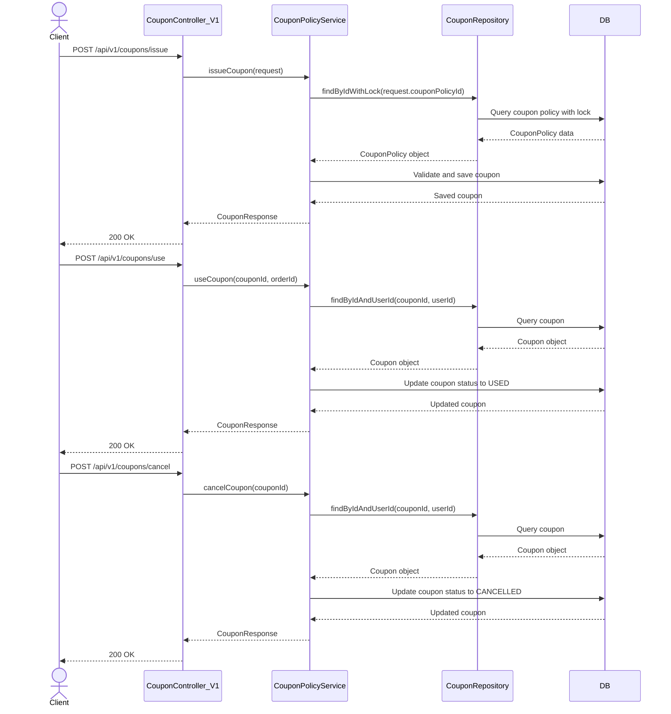

```mermaid
sequenceDiagram
    actor Client
    participant CouponController_V1
    participant CouponPolicyService
    participant CouponRepository
    participant DB

    Client->>CouponController_V1: POST /api/v1/coupons/issue
    CouponController_V1->>CouponPolicyService: issueCoupon(request)

    CouponPolicyService->>CouponRepository: findByIdWithLock(request.couponPolicyId)
    CouponRepository->>DB: Query coupon policy with lock
    DB-->>CouponRepository: CouponPolicy data
    CouponRepository-->>CouponPolicyService: CouponPolicy object

    CouponPolicyService->>DB: Validate and save coupon
    DB-->>CouponPolicyService: Saved coupon

    CouponPolicyService-->>CouponController_V1: CouponResponse
    CouponController_V1-->>Client: 200 OK

    Client->>CouponController_V1: POST /api/v1/coupons/use
    CouponController_V1->>CouponPolicyService: useCoupon(couponId, orderId)

    CouponPolicyService->>CouponRepository: findByIdAndUserId(couponId, userId)
    CouponRepository->>DB: Query coupon
    DB-->>CouponRepository: Coupon object
    CouponRepository-->>CouponPolicyService: Coupon object

    CouponPolicyService->>DB: Update coupon status to USED
    DB-->>CouponPolicyService: Updated coupon
    CouponPolicyService-->>CouponController_V1: CouponResponse
    CouponController_V1-->>Client: 200 OK

    Client->>CouponController_V1: POST /api/v1/coupons/cancel
    CouponController_V1->>CouponPolicyService: cancelCoupon(couponId)

    CouponPolicyService->>CouponRepository: findByIdAndUserId(couponId, userId)
    CouponRepository->>DB: Query coupon
    DB-->>CouponRepository: Coupon object
    CouponRepository-->>CouponPolicyService: Coupon object

    CouponPolicyService->>DB: Update coupon status to CANCELLED
    DB-->>CouponPolicyService: Updated coupon
    CouponPolicyService-->>CouponController_V1: CouponResponse
    CouponController_V1-->>Client: 200 OK
```