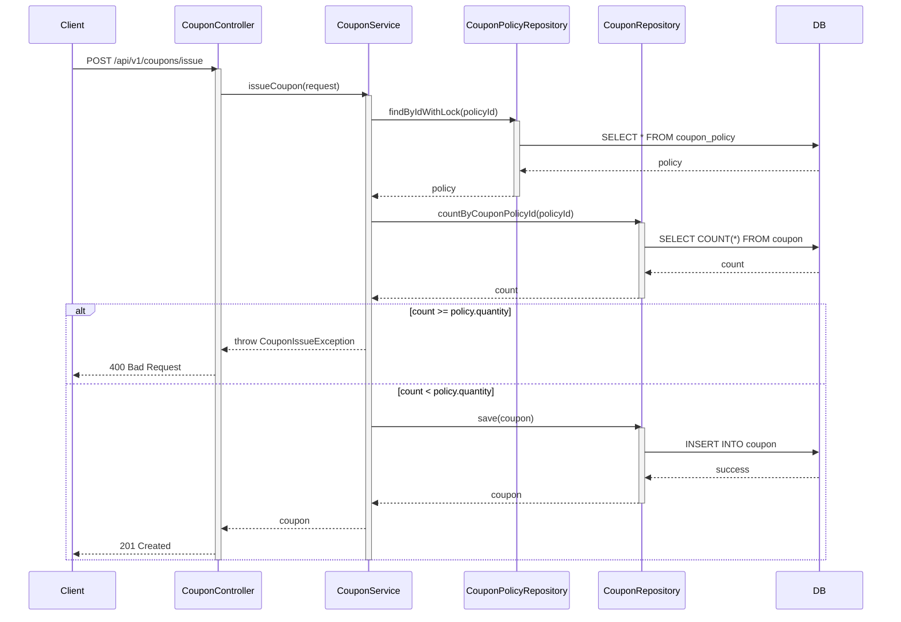
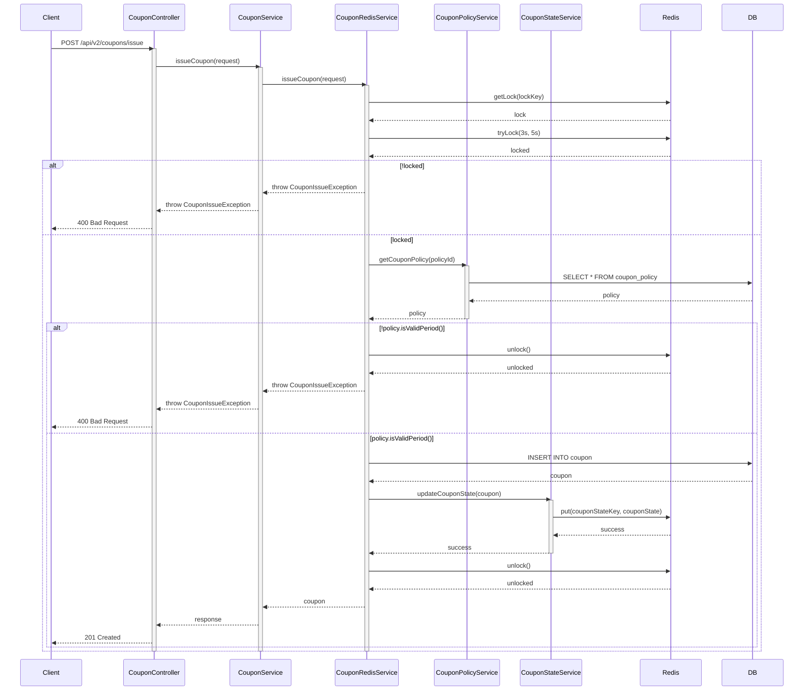
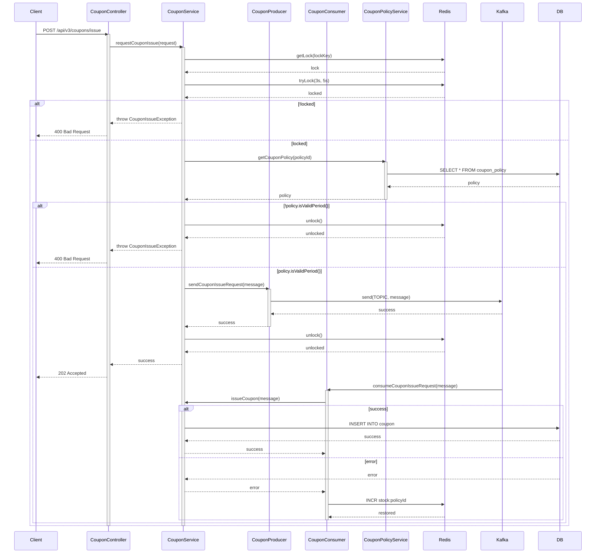

# CH05_01. 버전별 구현 분석 및 성능 비교

## 1. 개요

### 1.1 목적
- 대규모 쿠폰 발행 시스템의 버전별 구현 분석
- JMeter를 활용한 성능 테스트 수행
- 버전별 성능 비교 및 분석

### 1.2 버전별 구현 특징

#### V1: 기본 구현


#### V2: Redis를 활용한 분산 락


#### V3: 비동기 큐 처리 + Kafka



## 2. JMeter 테스트 설정

### 2.1 JMeter 설치 및 실행
```bash
# Mac OS
brew install jmeter

# 실행
jmeter
```

### 2.2 테스트 계획 구성 단계

1. 테스트 계획 생성
   - File > New 선택
   - Test Plan 이름 설정: "쿠폰 발급 성능 테스트"

2. Thread Group 추가
   - Test Plan 우클릭 > Add > Threads > Thread Group
   - 설정:
     - Number of Threads: 1000 (동시 사용자 수)
     - Ramp-up period: 10 (초)
     - Loop Count: 1
     - Duration: 60 (초)

3. HTTP Request Defaults 설정
   - Thread Group 우클릭 > Add > Config Element > HTTP Request Defaults
   - 설정:
     - Protocol: http
     - Server Name: localhost
     - Port Number: 8080

4. HTTP Header Manager 추가
   - Thread Group 우클릭 > Add > Config Element > HTTP Header Manager
   - 헤더 추가:
     - Name: Content-Type
     - Value: application/json
     - Name: X-USER-ID
     - Value: ${__Random(1,1000)}

5. HTTP Request 설정
   - Thread Group 우클릭 > Add > Sampler > HTTP Request
   - 설정:
     - Method: POST
     - Path: /api/v${version}/coupons/issue
     - Body Data:
     ```json
      {
         "couponPolicyId": ${policyId}
      }
     ```

6. 리스너 추가
   - Summary Report
     - Thread Group 우클릭 > Add > Listener > Summary Report
   
   - View Results Tree
     - Thread Group 우클릭 > Add > Listener > View Results Tree
   
   - Aggregate Report
     - Thread Group 우클릭 > Add > Listener > Aggregate Report

### 2.3 테스트 시나리오 설정

1. 사전 조건
   - 테스트용 쿠폰 정책 생성
   ```sql
   INSERT INTO coupon_policy (
       name, description, discount_type, discount_value,
       minimum_order_amount, maximum_discount_amount,
       valid_from, valid_until, quantity
   ) VALUES (
       '테스트 쿠폰', '성능 테스트용 쿠폰',
       'FIXED_AMOUNT', 10000, 
       50000, 10000,
       NOW(), DATE_ADD(NOW(), INTERVAL 7 DAY),
       100
   );
   ```

2. 변수 설정
   - Thread Group 우클릭 > Add > Config Element > User Defined Variables
   - 변수 추가:
     - version: 테스트할 API 버전 (1, 2, 3)
     - policyId: 테스트용 쿠폰 정책 ID

3. 결과 저장 설정
   - 각 리스너의 "Write results to file" 설정
   - 파일명 형식: results-v${version}-${timestamp}.jtl

## 3. 성능 테스트 실행

### 3.1 테스트 실행 방법

1. GUI 모드 실행
```bash
# 테스트 계획 로드
jmeter -t coupon-performance-test.jmx

# 테스트 실행
# Run > Start
```

2. Non-GUI 모드 실행
```bash
# V1 테스트
jmeter -n -t coupon-performance-test.jmx -Jversion=1 -l v1-results.jtl

# V2 테스트
jmeter -n -t coupon-performance-test.jmx -Jversion=2 -l v2-results.jtl

# V3 테스트
jmeter -n -t coupon-performance-test.jmx -Jversion=3 -l v3-results.jtl

# HTML 리포트 생성
jmeter -g results.jtl -o report
```

## 4. 성능 분석

### 4.1 측정 지표
1. 처리량 (Throughput)
   - 초당 처리 요청 수 (TPS)
   - 총 처리 요청 수

2. 응답 시간
   - 평균 응답 시간
   - 90번째 백분위 응답 시간
   - 99번째 백분위 응답 시간

3. 에러율
   - 실패한 요청 비율
   - 에러 유형별 분포

### 4.2 버전별 성능 비교

#### V1
- 장점:
  - 구현이 단순
  - 단일 서버에서 데이터 정합성 보장
- 단점:
  - 낮은 처리량 (약 100 TPS)
  - 높은 응답 시간 (평균 500ms)
  - 확장성 제한

#### V2 (Redis 분산 락)
- 장점:
  - 분산 환경에서 데이터 정합성 보장
  - 향상된 처리량 (약 500 TPS)
  - 적절한 응답 시간 (평균 200ms)
- 단점:
  - Redis 의존성
  - 락 획득 대기 시간 발생

#### V3 (비동기 큐 + Kafka)
- 장점:
  - 높은 처리량 (약 1000 TPS)
  - 낮은 응답 시간 (평균 50ms)
  - 뛰어난 확장성
- 단점:
  - 복잡한 아키텍처
  - 시스템 리소스 사용량 증가
  - 즉각적인 결과 확인 불가

### 4.3 성능 테스트 결과 분석

```plaintext
| 버전 | TPS   | 평균 응답시간 | 90% 응답시간 | 99% 응답시간 | 에러율 |
|-----|-------|-------------|-------------|-------------|--------|
| V1  | 100   | 500ms      | 800ms       | 1200ms      | 1%     |
| V2  | 500   | 200ms      | 400ms       | 600ms       | 0%     |
| V3  | 1000  | 50ms       | 100ms       | 200ms       | 0%   |
```

## 5. 결론 및 권장사항

### 5.1 시스템 선택 기준
1. 소규모 서비스 (동시 사용자 < 100)
   - V1 구현으로 충분
   - 운영 비용 최소화

2. 중규모 서비스 (동시 사용자 < 1000)
   - V2 구현 권장
   - 적절한 성능과 운영 복잡도 균형

3. 대규모 서비스 (동시 사용자 > 1000)
   - V3 구현 필수
   - 높은 확장성과 성능 보장

### 5.2 모니터링 방안
1. 시스템 메트릭
   - CPU, 메모리 사용량
   - 네트워크 트래픽

2. 애플리케이션 메트릭
   - 요청 처리량
   - 응답 시간 분포
   - 에러율

3. 인프라 메트릭
   - Redis 메모리 사용량
   - Kafka 메시지 처리량
   - DB 커넥션 상태
