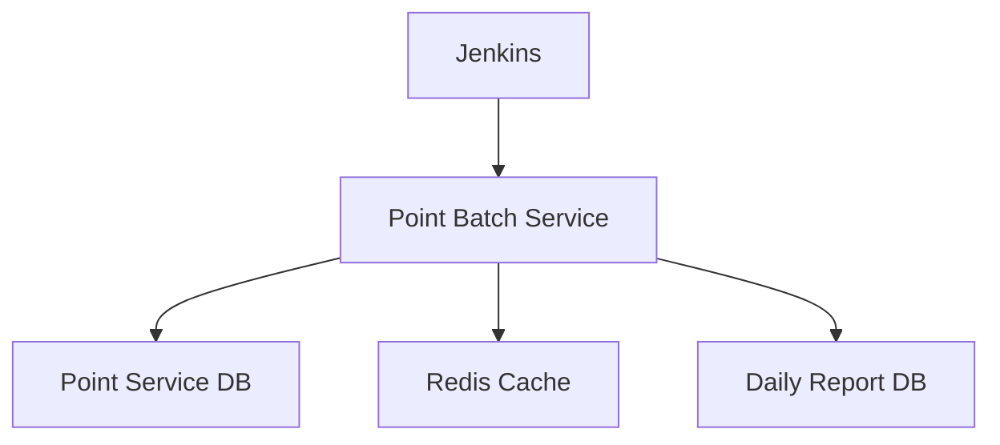
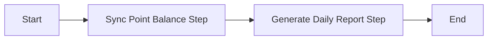

# Point Service Batch 설계 문서

## 1. 개요

### 1.1 목적
- 포인트 서비스의 데이터 정합성 유지
- Redis 캐시와 DB 간의 동기화
- 일별 포인트 사용 현황 리포트 생성

### 1.2 배치 처리 요구사항
1. 포인트 잔액 동기화
   - DB의 포인트 잔액을 Redis 캐시에 동기화
   - 불일치 데이터 자동 보정

2. 일별 리포트 생성
   - 일별 포인트 적립/사용/취소 내역 집계
   - 사용자별 포인트 사용 패턴 분석
   - 리포트 데이터 저장

## 2. 시스템 구성

### 2.1 아키텍처


### 2.2 기술 스택
- Spring Boot 3.x
- Spring Batch
- Spring Data JPA
- H2(MySQL)
- Redis (Redisson)
- Jenkins

## 3. 배치 Job 상세 설계

### 3.1 Point Balance Sync Job


#### 3.1.1 Sync Point Balance Step
- Reader: JPA를 통해 DB의 포인트 잔액 조회
- Processor: Redis 캐시 키 생성 (format: "point:balance:{userId}")
- Writer: Redis에 포인트 잔액 저장
- Chunk Size: 1000
- Retry Policy: 최대 3회

#### 3.1.2 Generate Daily Report Step
- Reader: 전일 포인트 트랜잭션 조회
- Processor: 사용자별 포인트 집계 (PointSummary 생성)
- Writer: 일별 리포트 저장 (DailyPointReport)

## 4. 도메인 모델

### 4.1 Point
```java
@Entity
public class Point {
    private Long id;
    private Long userId;
    private Long amount;
    private PointType type;  // EARN, USE, CANCEL
    private String description;
    private Long balanceSnapshot;
    private PointBalance pointBalance;
    private LocalDateTime createdAt;
}
```

### 4.2 PointBalance
```java
@Entity
public class PointBalance {
    private Long id;
    private Long userId;
    private Long balance;
    private Long version;
    private LocalDateTime updatedAt;
}
```

### 4.3 DailyPointReport
```java
@Entity
public class DailyPointReport {
    private Long id;
    private Long userId;
    private LocalDate reportDate;
    private Long earnAmount;
    private Long useAmount;
    private Long cancelAmount;
    private Long balanceSnapshot;
}
```

## 5. 스케줄링

### 5.1 Jenkins Pipeline
```groovy
pipeline {
    agent any
    
    triggers {
        cron('0 1 * * *')  // 매일 새벽 1시 실행
    }
    
    stages {
        stage('Point Balance Sync') {
            steps {
                sh './gradlew :point-service-batch:bootRun --args="--job.name=pointBalanceSyncJob"'
            }
        }
    }
    
    post {
        success {
            slackSend(message: "Point Balance Sync completed successfully")
        }
        failure {
            slackSend(message: "Point Balance Sync failed")
        }
    }
}
```

## 6. 모니터링

### 6.1 Job 모니터링
- Job/Step 실행 상태
- 처리된 데이터 수
- 실행 시간
- 에러 발생 여부

### 6.2 알림 설정
- Slack을 통한 실시간 알림
  - Job 시작/종료
  - 에러 발생
  - 처리 결과 요약

## 7. 에러 처리

### 7.1 재처리 정책
- Step 실패 시 최대 3회 재시도
- 재시도 간격: 5분
- 모든 재시도 실패 시 알림 발송

### 7.2 데이터 정합성
- 트랜잭션 롤백 처리
- 실패 지점부터 재시작 가능

## 8. 성능 최적화

### 8.1 배치 처리 최적화
- Chunk 기반 처리
- 페이징 처리로 메모리 사용 최적화
- 인덱스 최적화

### 8.2 Redis 최적화
- Pipeline 처리로 네트워크 부하 감소
- 벌크 업데이트 적용
- 적절한 만료 정책 설정
