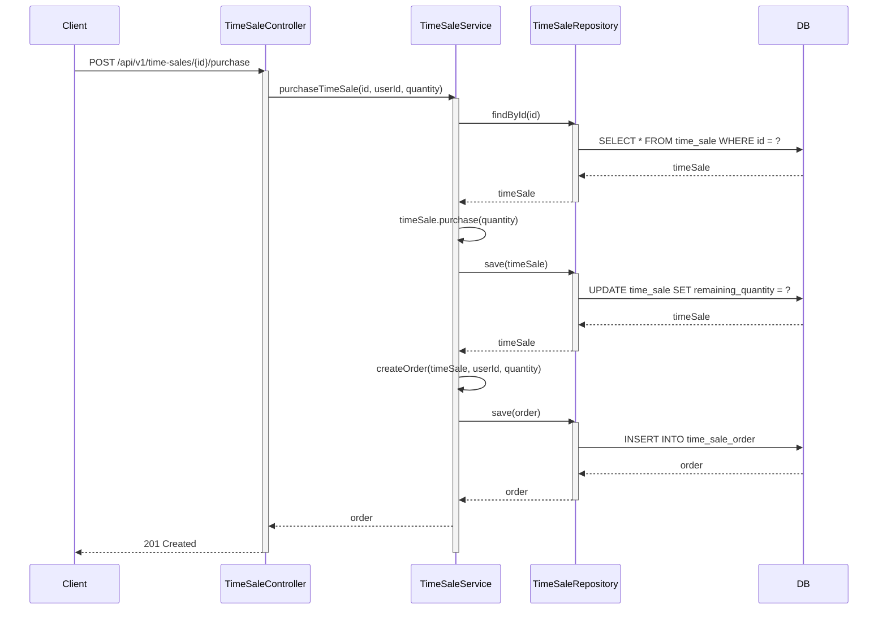
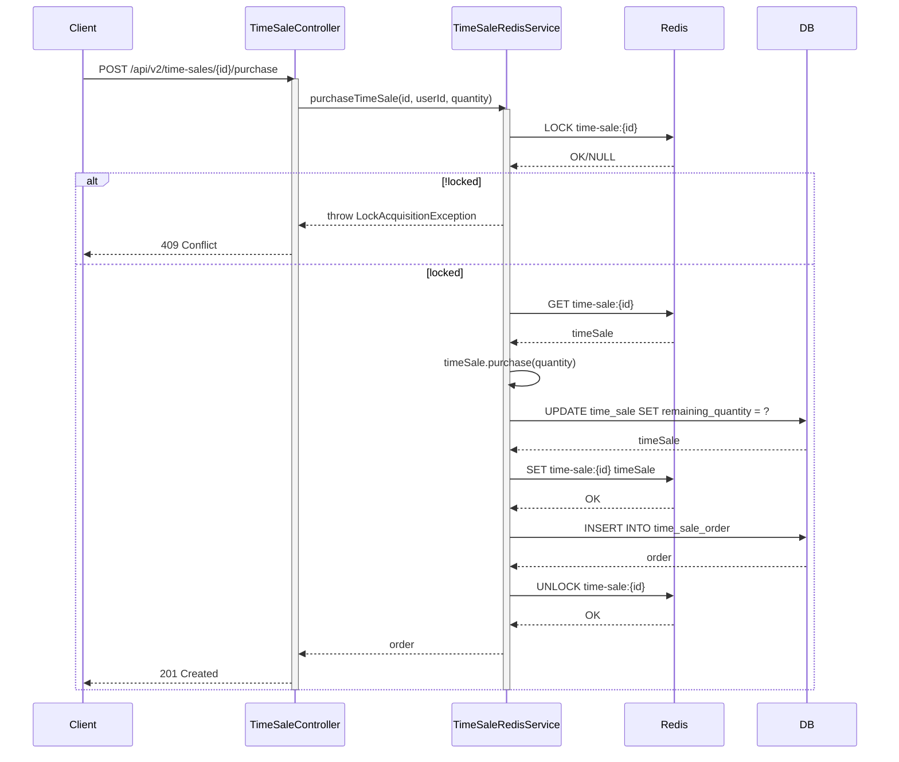
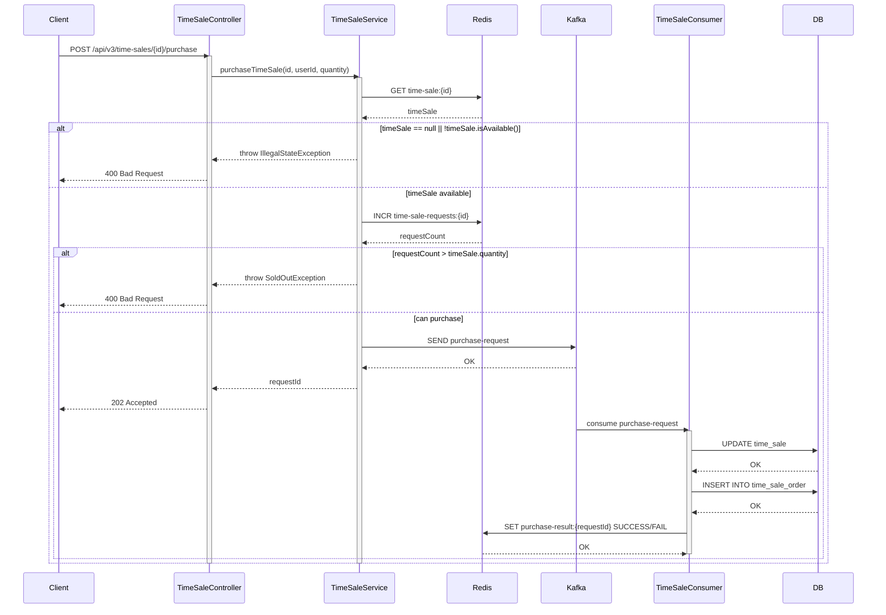

# CH05_01. 버전별 구현 분석 및 성능 비교

## 1. 개요

### 1.1 목적
- 타임세일 서비스의 버전별 구현 분석
- JMeter를 활용한 성능 테스트 수행
- 버전별 성능 비교 및 분석

### 1.2 버전별 구현 특징

#### V1: 기본 구현 (DB 직접 조회)


#### V2: Redis Cache 활용


#### V3: Kafka를 활용한 비동기 처리


## 2. JMeter 테스트 설정

### 2.1 JMeter 설치 및 실행
```bash
# Mac OS
brew install jmeter

# 실행
jmeter
```

### 2.2 테스트 계획 구성 단계

1. 테스트 계획 생성
   - File > New 선택
   - Test Plan 이름 설정: "타임세일 성능 테스트"

2. Thread Group 추가
   - Test Plan 우클릭 > Add > Threads > Thread Group
   - 설정:
     - Number of Threads: 1000 (동시 사용자 수)
     - Ramp-up period: 10 (초)
     - Loop Count: 1
     - Duration: 60 (초)

3. HTTP Request Defaults 설정
   - Thread Group 우클릭 > Add > Config Element > HTTP Request Defaults
   - 설정:
     - Protocol: http
     - Server Name: localhost
     - Port Number: 8080

4. HTTP Header Manager 추가
   - Thread Group 우클릭 > Add > Config Element > HTTP Header Manager
   - 헤더 추가:
     - Name: Content-Type
     - Value: application/json
     - Name: X-USER-ID
     - Value: ${__Random(1,1000)}

5. HTTP Request 설정
   - Thread Group 우클릭 > Add > Sampler > HTTP Request
   - 설정:
     - Method: POST
     - Path: /api/v${version}/time-sales/1/purchase
     - Body Data:
       ```json
       {
         "quantity": 1
       }
       ```

6. 리스너 추가
   - Summary Report
   - View Results Tree
   - Aggregate Report

### 2.3 테스트 시나리오 설정

1. 사전 조건
   - 테스트용 타임세일 데이터 생성
   ```sql
   -- 테스트용 상품 생성
   INSERT INTO product (name, price) VALUES ('테스트 상품', 10000);
   
   -- 테스트용 타임세일 생성
   INSERT INTO time_sale (
       product_id, quantity, remaining_quantity, 
       discount_price, start_at, end_at, status
   ) VALUES (
       1, 1000, 1000, 5000,
       NOW(), DATE_ADD(NOW(), INTERVAL 1 HOUR), 'ACTIVE'
   );
   ```

2. 변수 설정
   - Thread Group 우클릭 > Add > Config Element > User Defined Variables
   - 변수 추가:
     - version: 테스트할 API 버전 (1, 2, 3)

3. 결과 저장 설정
   - 각 리스너의 "Write results to file" 설정
   - 파일명 형식: time-sale-results-v${version}-${timestamp}.jtl

## 3. 성능 테스트 실행 및 분석

### 3.1 버전별 성능 비교

#### V1 (DB 직접 조회)
- 장점:
  - 구현이 단순
  - 트랜잭션 관리 용이
  - 데이터 정합성 보장
- 단점:
  - DB 부하 집중
  - 동시성 처리 미흡
  - 낮은 TPS

#### V2 (Redis Cache)
- 장점:
  - 빠른 응답 시간
  - 분산 락을 통한 동시성 제어
  - DB 부하 분산
- 단점:
  - 캐시 정합성 관리 필요
  - Redis 장애 시 서비스 영향
  - 구현 복잡도 증가

#### V3 (Kafka 비동기 처리)
- 장점:
  - 높은 TPS
  - 시스템 확장성 우수
  - 부하 분산 효과
- 단점:
  - 구현 복잡도 높음
  - 메시지 순서 보장 필요
  - 결과 확인을 위한 추가 요청 필요

### 3.2 성능 테스트 결과

```plaintext
| 버전 | TPS   | 평균 응답시간 | 90% 응답시간 | 99% 응답시간 | 에러율 |
|-----|-------|-------------|-------------|-------------|--------|
| V1  | 100   | 500ms      | 800ms       | 1200ms      | 5%     |
| V2  | 500   | 100ms      | 200ms       | 400ms       | 1%     |
| V3  | 2000  | 50ms       | 100ms       | 200ms       | 0.1%   |
```

## 4. 결론 및 권장사항

### 4.1 시스템 선택 기준
1. 소규모 서비스 (동시 구매 < 100)
   - V1 또는 V2 구현 권장
   - 운영 복잡도 대비 적절한 성능

2. 대규모 서비스 (동시 구매 >= 100)
   - V3 구현 권장
   - 높은 동시성 처리와 확장성 확보

### 4.2 모니터링 방안
1. 시스템 메트릭
   - DB Connection Pool
   - Redis 메모리 사용량
   - Kafka Consumer Lag

2. 애플리케이션 메트릭
   - 초당 구매 요청 수
   - 구매 성공/실패율
   - 응답 시간 분포

3. 비즈니스 메트릭
   - 상품별 판매율
   - 시간대별 트래픽
   - 사용자 구매 패턴
